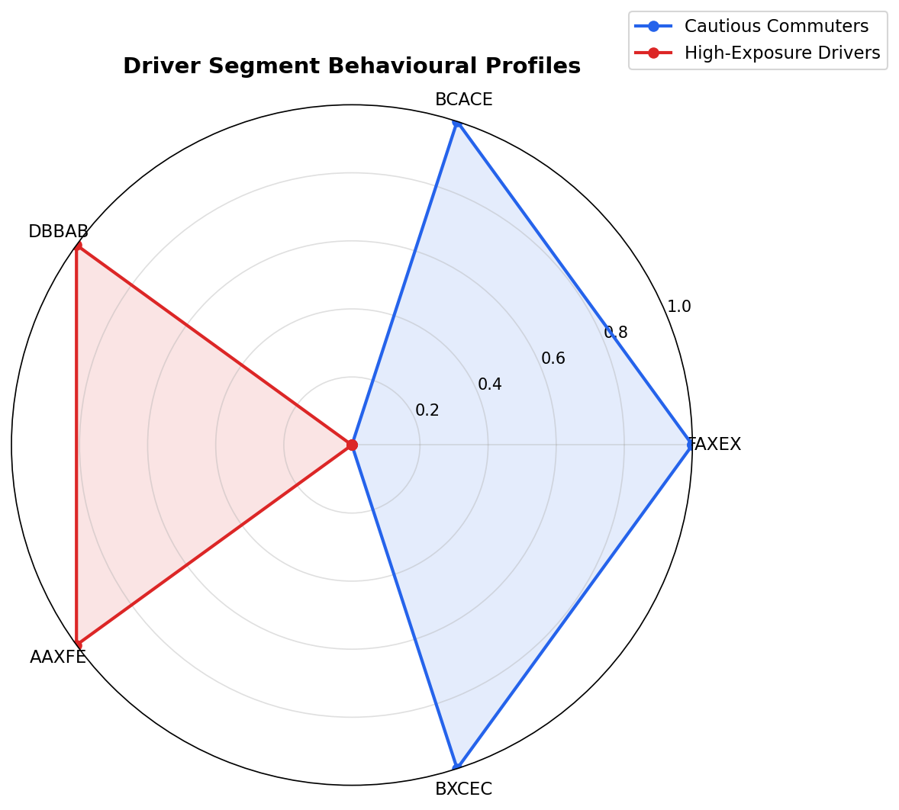

# Driver Behavior Clustering


---

## Business Context

An auto-insurance company is redesigning its pricing model. The conventional approach — a single actuarial table applied to all policyholders — fails to reflect the genuine risk heterogeneity in a modern driver population. This project develops an unsupervised segmentation model that groups 10,000 policyholders into behaviorally coherent clusters, enabling the pricing team to build separate, risk-appropriate pricing models for each segment.

The analysis covers algorithm selection, cluster validation, business interpretation of segments, and a production-ready prediction pipeline for scoring new drivers at policy inception.

---

## Results at a Glance

| Metric | Value |
|--------|-------|
| Final Algorithm | K-Means |
| Optimal Clusters | 2 |
| Silhouette Score | 0.3235 |
| Davies-Bouldin Index | 1.2377 |
| Calinski-Harabasz Index | 5706.15 |
| Dataset Size | 10,000 drivers, 5 features |

---

## Driver Segment Profiles



| Segment | Label | Key Traits | Risk Level | Pricing Action |
|---------|-------|------------|------------|----------------|
| Cluster 0 | Cautious Commuters | Low braking events, short trips, daytime driving | Low | 10–20% loyalty discount; telematics programme upsell |
| Cluster 1 | High-Exposure Drivers | Elevated speed variance, night driving, frequent hard braking | Elevated | Risk-adjusted surcharge; telematics opt-in for premium reduction |

---

## Project Structure

```
driver-behavior-clustering/
├── dataset/
│   └── driver_behavior.csv          # 10,000 drivers, 5 engineered features
├── notebooks/
│   └── 01_Clustering_Analysis.ipynb # Full analysis: EDA → clustering → business narrative
├── src/
│   ├── __init__.py
│   ├── evaluate.py                   # Reusable metric functions
│   └── models.py                     # ClusterModel wrapper with save/load/predict
├── app/
│   └── streamlit_app.py              # Interactive dashboard
├── reports/
│   └── figures/                      # All saved visualisations
├── config.yaml                       # Centralised configuration (no magic numbers in code)
├── requirements.txt                  # Pinned dependencies
└── README.md
```

---

## Algorithms Evaluated

Three clustering paradigms were evaluated. K-Means was selected as the final model on the basis of metric performance, interpretable centroids, and production compatibility.

| Algorithm | Clusters Found | Silhouette Score | Davies-Bouldin Index | Calinski-Harabasz Index |
|-----------|---------------|-----------------|---------------------|------------------------|
| **K-Means (k=2)** | **2** | **0.3235** | **1.2377** | **5706.15** |
| Agglomerative Hierarchical (k=2) | 2 | — | — | — |
| DBSCAN | varies | — | — | — |

*Full metric table with all configurations is produced in the notebook.*

---

## How to Reproduce

```bash
# 1. Clone the repository
git clone https://github.com/KingsAxe/driver-behavior-clustering.git
cd driver-behavior-clustering

# 2. Install dependencies
pip install -r requirements.txt

# 3. Install the src package in editable mode (one-time, run from repo root)
#    This makes 'from src.evaluate import ...' work from any directory,
#    including inside the notebook regardless of how Jupyter was launched.
pip install -e .

# 4. Run the notebook
jupyter notebook notebooks/01_Clustering_Analysis.ipynb
```

---

## How to Run the Dashboard

```bash
streamlit run app/streamlit_app.py
```

The dashboard provides:
- Live cluster explorer (interactive PCA scatter with Plotly)
- Algorithm comparison table
- Driver persona profile cards
- New driver prediction tool (enter feature values, receive segment assignment and pricing recommendation)

---

## Responsible AI Notice

This project is a technical demonstration. Any production deployment of cluster-based insurance pricing must satisfy:

- **UK Equality Act 2010** — no differential treatment on protected characteristics
- **FCA Consumer Duty (2023)** — pricing must demonstrably benefit the customer
- **UK GDPR** — explicit consent, data minimisation, and right-to-explanation for telematics data
- **IBM Responsible AI principles** — fairness, transparency, and explainability at every stage

A full Responsible AI section with disparity impact analysis recommendations is included in the notebook.

---

## Author

**Kingsley Ohere**  
Skills: Python · Unsupervised Learning · Clustering · PCA · Streamlit · scikit-learn
